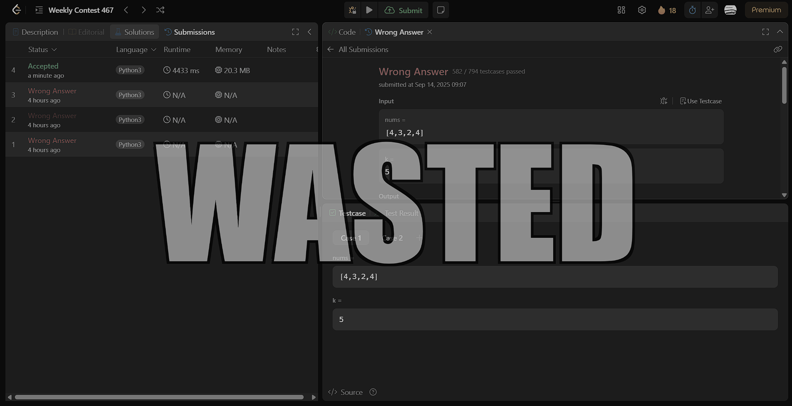

# LeetCode Wasted Screen 

Turns your LeetCode submission failures into the iconic "WASTED" screen from the Grand Theft Auto series. Because if you're going to fail, you might as well do it in style. Also, Tired of seeing red all over, lets GAMI-FY IT.


---

## Why?

Let's be honest, seeing "Wrong Answer" or "Time Limit Exceeded" can be frustrating. This simple browser extension transforms that moment of disappointment into a moment of dark, cinematic humor, helping you laugh off a failed submission and get right back to coding.

## Features

-   **Cinematic Failure:** The entire page fades to a high-contrast grayscale upon failure.
-   **Iconic Overlay:** The classic bold, white "WASTED" text appears front and center.
-   **Authentic Sound:** The mournful "wasted" sound effect plays to complete the experience.
-   **Universal Detection:** Works for all common failure types:
    -   Wrong Answer
    -   Time Limit Exceeded
    -   Memory Limit Exceeded
    -   Runtime Error
    -   Compile Error
-   **Supports "Run" and "Submit":** Triggers on test case runs in the console as well as final submissions.
-   **Clean & Temporary:** The effect lasts for 4 seconds and then completely disappears, letting you get back to work.
-   **SPA-Aware:** Intelligently handles LeetCode's single-page application navigation, cleaning up the effect immediately if you navigate to a new page.

## Installation

This extension is not on the Chrome Web Store, so you'll need to load it manually. It only takes a minute!

1.  **Download the Code:**
    -   **Option A (Git):** Clone this repository to your local machine:
        ```bash
        git clone https://github.com/your-username/leetcode-wasted-screen.git
        ```
    -   **Option B (ZIP):** Click the `Code` button on this repository's page and select `Download ZIP`. Unzip the file.

2.  **Open Chrome Extensions:**
    -   Open Google Chrome and navigate to `chrome://extensions` in the address bar.

3.  **Enable Developer Mode:**
    -   In the top-right corner of the Extensions page, turn on the "Developer mode" toggle.

4.  **Load the Extension:**
    -   A new set of buttons will appear. Click on **"Load unpacked"**.
    -   A file dialog will open. Navigate to and select the **entire `leetcode-wasted` folder** that you downloaded.

✅ That's it! The "LeetCode Wasted Screen" extension will now appear in your list of extensions and is ready to go.

## Usage

1.  Navigate to any problem on LeetCode.
2.  Write some code that is destined to fail.
3.  Click the "Run" or "Submit" button.
4.  Enjoy your cinematic failure.

## How It Works (For the Curious)

This is a simple but effective extension that uses a few key browser APIs:

-   **`manifest.json`**: This is the blueprint of the extension, telling Chrome which files to use and what permissions it needs.
-   **Content Script (`content.js`)**: This is the core logic. It's injected directly into LeetCode problem pages.
    -   **`MutationObserver`**: A "spy" that watches the LeetCode page for changes. When it detects that a result (like "Wrong Answer") has been added to the page, it triggers the effect.
    -   **Audio Handling**: It handles the browser's autoplay policy by "unlocking" the audio context on the user's first click, ensuring the sound can play when needed.
    -   **Navigation Handling**: A `setInterval` checks for URL changes to clean up the effect instantly if the user navigates away, which is necessary for Single Page Applications like LeetCode.
-   **CSS (`style.css`)**: This file contains the visual styles for the grayscale filter (`filter: grayscale(...)`), the overlay, and the "WASTED" text (styled with `text-shadow` to create the iconic outline).

## Contributing

Found a bug or have an idea for an improvement? Feel free to open an issue or submit a pull request!

## License

This project is licensed under the MIT License. See the [LICENSE](LICENSE) file for details.